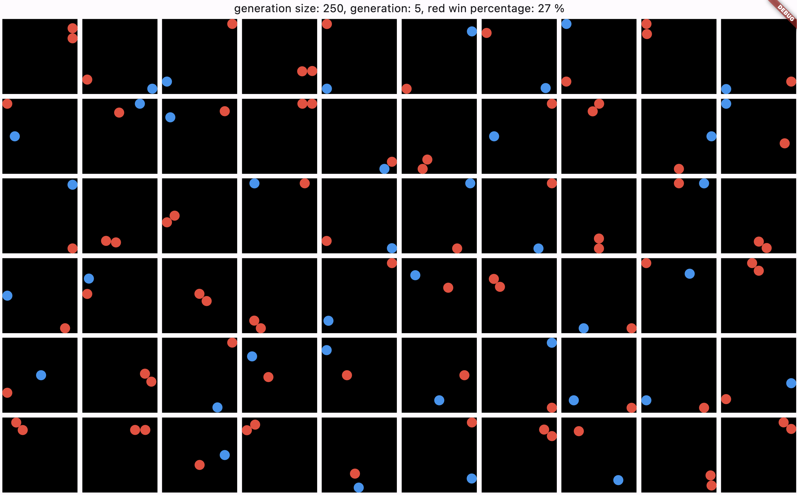
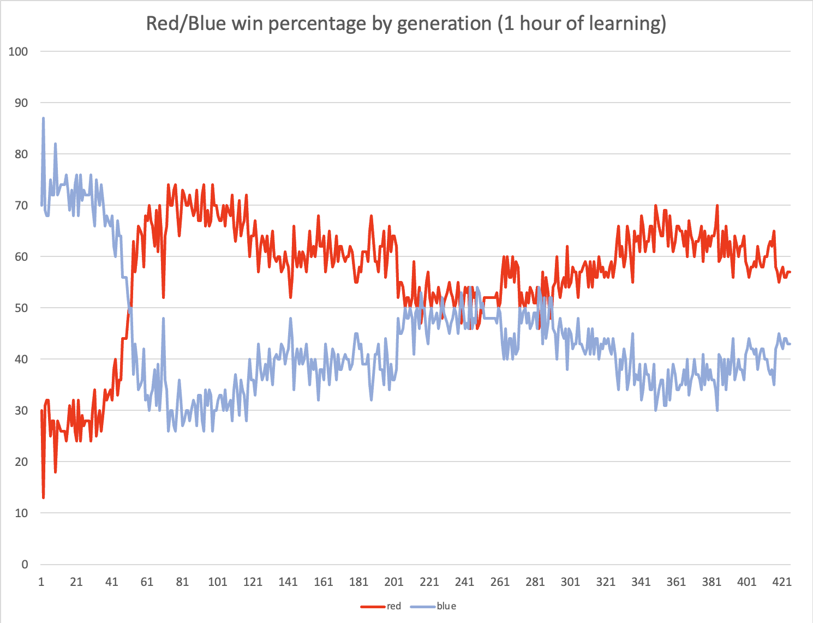

# Genetic algorithm which learns to play the game of tag
The red balls are trying to catch the blue balls under 8 seconds. The generation size is 250. The most suitable balls are selected to reproduce and create the next generation.
We can clearly see some learning in both teams but the learning is not currently enough to create a really smart generation.

